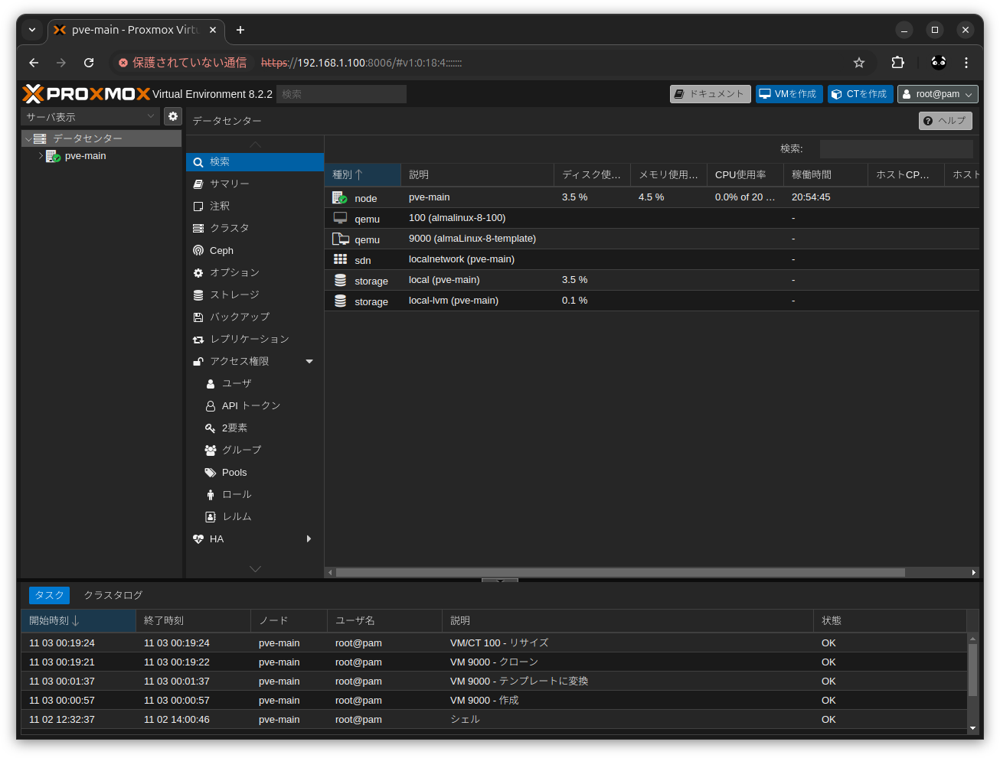
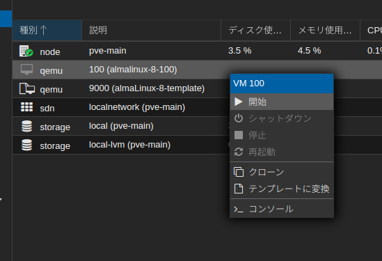

# proxmox-ve_qemu_almalinux-8

## ※作成中

## 概要
* Proxmox VE 8.2 
* AlmaLinux 8 の汎用クラウド(Cloud-init)イメージをテンプレートに登録
* Terraform を使って IaC で Proxmox VE に環境を構築

Proxmox VE  
https://www.proxmox.com/en/proxmox-virtual-environment/overview  

AlmaLinux OS Generic Cloud (Cloud-init) image  
https://wiki.almalinux.org/cloud/Generic-cloud.html#download-images  

Terraform  
https://www.terraform.io/  

## 前提
* Proxmox VE 8.2 が使える状態であること

Proxmox VE 8.2 をインストールした時のメモ  
https://github.com/Tobotobo/proxmox-ve_instlal_memo  

## 詳細

* [AlmaLinux 8 の汎用クラウド(Cloud-init)イメージをテンプレートに登録](docs/001_create_template_almalinux_8_cloud_image.md)
* [テンプレートから VM インスタンスを作成(コマンド)](docs/002_create_vm_instance_from_template_with_command.md)

    * `local` ストレージのコンテンツタイプに `snippets` を追加
    ```
    pvesm set local --content iso,backup,snippets,vztmpl
    pvesm set local --content snippets
    pvesm set local --content images,iso,vztmpl,backup,snippets
    ```

```sh
# 設定
template_vm_id=9000
vm_id=100
vm_name=almalinux-8-${vm_id}
vm_user=alma
vm_pass=alma
vm_cores=2
vm_memory=2048
vm_disksize=20G

vm_pass_hash=$(openssl passwd -6 "${vm_pass}")
cloud_config_filename=${vm_name}_cloud-config.yaml

# cloud-init
cat <<EOF > "/var/lib/vz/snippets/${cloud_config_filename}"
#cloud-config
hostname: ${vm_name}
fqdn: ${vm_name}.local

bootcmd:
  - dnf config-manager --add-repo https://download.docker.com/linux/centos/docker-ce.repo

package_update: true
packages:
  - glibc-langpack-ja
  - langpacks-ja
  - avahi
  - nano
  - git
  - docker-ce
  - docker-ce-cli
  - containerd.io

timezone: Asia/Tokyo
locale: ja_JP.utf8
keyboard:
  layout: jp

# Proxmox Console でロケールが適用されない問題への対応
write_files:
  - path: /etc/profile.d/locale_load.sh
    content: |
      if [ -f /etc/locale.conf ]; then
          source /etc/locale.conf
      fi
    permissions: '0644'

ssh_pwauth: true

users:
  - name: ${vm_user}
    passwd: ${vm_pass_hash}
    lock_passwd: false
    sudo: ALL=(ALL) NOPASSWD:ALL
    groups: 
      - sudo
      - docker
    shell: /bin/bash

runcmd:
    # avahi-daemon の起動 & 自動起動の有効化
    - systemctl start avahi-daemon
    - systemctl enable avahi-daemon

    # docker の起動 & 自動起動の有効化
    - systemctl start docker
    - systemctl enable docker
EOF

qm clone ${template_vm_id} ${vm_id}
qm set ${vm_id} --name ${vm_name}
qm set ${vm_id} --cores ${vm_cores}
qm set ${vm_id} --memory ${vm_memory}
qm resize ${vm_id} scsi0 ${vm_disksize}
qm set ${vm_id} --cicustom "user=local:snippets/${cloud_config_filename}"
```

```
root@pve-main:~# # 設定
template_vm_id=9000
vm_id=100
vm_name=almalinux-8-${vm_id}
vm_user=alma
vm_pass=alma
vm_cores=2
vm_memory=2048
vm_disksize=20G

vm_pass_hash=$(openssl passwd -6 "${vm_pass}")
cloud_config_filename=${vm_name}_cloud-config.yaml

# cloud-init
qm set ${vm_id} --cicustom "user=local:snippets/${cloud_config_filename}"
-bash: /var/lib/vz/snippets/almalinux-8-100_cloud-config.yaml: No such file or directory
create full clone of drive ide2 (local-lvm:vm-9000-cloudinit)
  Logical volume "vm-100-cloudinit" created.
create linked clone of drive scsi0 (local-lvm:base-9000-disk-0)
  Logical volume "vm-100-disk-0" created.
update VM 100: -name almalinux-8-100
update VM 100: -cores 2
update VM 100: -memory 2048
  Size of logical volume pve/vm-100-disk-0 changed from 10.00 GiB (2560 extents) to 20.00 GiB (5120 extents).
  Logical volume pve/vm-100-disk-0 successfully resized.
update VM 100: -cicustom user=local:snippets/almalinux-8-100_cloud-config.yaml
root@pve-main:~# 
```





```sh
vm_id=100
qm stop ${vm_id}
qm destroy ${vm_id}
```

```sh
vm_id=100
qm start ${vm_id}
```

```
qm list
```

/var/log/cloud-init.log
/var/log/cloud-init-output.log

```
docker run --rm -it -p 80:80 nginx
```
http://almalinux-8-100.local/