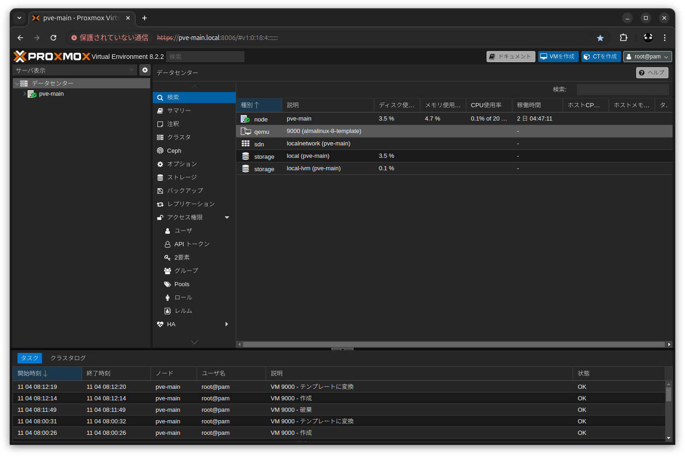

# AlmaLinux 8 の汎用クラウド(Cloud-init)イメージをテンプレートに登録

## 概要
* AlmaLinux OS PGP公開鍵をインポート
* AlmaLinux 8 の汎用クラウド(Cloud-init)イメージをダウンロード
* ダウンロードしたイメージを Proxmox VE のテンプレートに登録

## 詳細
* 適当な方法で Proxmox VE に管理者権限でコマンド叩ける状態にして以下を実行  
※参考：[Proxmox VE をコマンドラインで操作する](https://github.com/Tobotobo/proxmox-ve_instlal_memo?tab=readme-ov-file#proxmox-ve-%E3%82%92%E3%82%B3%E3%83%9E%E3%83%B3%E3%83%89%E3%83%A9%E3%82%A4%E3%83%B3%E3%81%A7%E6%93%8D%E4%BD%9C%E3%81%99%E3%82%8B)  
* AlmaLinux OS PGP公開鍵をインポートする
    * 公開鍵をダウンロード
        ```
        curl -O -s https://repo.almalinux.org/almalinux/RPM-GPG-KEY-AlmaLinux
        ```
        実行後
        ```
        root@pve-main:~# curl -O -s https://repo.almalinux.org/almalinux/RPM-GPG-KEY-AlmaLinux
        root@pve-main:~# ls
        RPM-GPG-KEY-AlmaLinux
        ```
    * ダウンロードした公開鍵が本物か確認  
        ```
        gpg --with-subkey-fingerprints RPM-GPG-KEY-AlmaLinux
        ```
        実行後  
        ２つ目の pub の値が `BC5E DDCA DF50 2C07 7F15 8288 2AE8 1E8A CED7 258B` か確認　※2024/11/2 時点
        ```
        root@pve-main:~# gpg --with-subkey-fingerprints RPM-GPG-KEY-AlmaLinux
        gpg: WARNING: no command supplied.  Trying to guess what you mean ...
        pub   rsa4096 2021-01-12 [C] [expired: 2024-01-12]
            5E9B8F5617B5066CE92057C3488FCF7C3ABB34F8
        uid           AlmaLinux <packager@almalinux.org>
        sub   rsa3072 2021-01-12 [S] [expired: 2024-01-12]
        pub   rsa4096 2023-10-10 [SC]
            BC5EDDCADF502C077F1582882AE81E8ACED7258B
        uid           AlmaLinux OS 8 <packager@almalinux.org>
        ```
        [AlmaLinux - GPG Keys](https://almalinux.org/security/)  
        > AlmaLinux OS 8 #2  
        > BC5E DDCA DF50 2C07 7F15 8288 2AE8 1E8A CED7 258B  

        ※2024/11/2 時点では公式の説明が古い。一つ目の鍵は 2024/1/12 に失効したため、２つ目の鍵のフィンガープリントを確認する  

        フィンガープリントとは（fingerprint）  
        https://japan.zdnet.com/glossary/exp/%E3%83%95%E3%82%A3%E3%83%B3%E3%82%AC%E3%83%BC%E3%83%97%E3%83%AA%E3%83%B3%E3%83%88/  
        > フィンガープリントとは、デジタルコンテンツの同一性を確認するために使用される値のことである。  
        > フィンガープリントは、デジタルコンテンツをハッシュ関数で計算した結果として出力される。 コンテンツのハッシュ値を照合することで、比べたデータが同一内容か、あるいは改竄された内容になっているか、判断することができる。
    * 公開鍵をインポート
        ```
        gpg --import RPM-GPG-KEY-AlmaLinux
        ```
        実行後
        ```
        root@pve-main:~# gpg --import RPM-GPG-KEY-AlmaLinux
        gpg: /root/.gnupg/trustdb.gpg: trustdb created
        gpg: key 488FCF7C3ABB34F8: public key "AlmaLinux <packager@almalinux.org>" imported
        gpg: key 2AE81E8ACED7258B: public key "AlmaLinux OS 8 <packager@almalinux.org>" imported
        gpg: Total number processed: 2
        gpg:               imported: 2
        ```
* AlmaLinux 8 の汎用クラウド(Cloud-init)イメージをダウンロード
    * イメージをダウンロードする前に、チェックサムとその署名をダウンロード
        ```
        curl -O -s https://repo.almalinux.org/almalinux/8/cloud/x86_64/images/CHECKSUM
        curl -O -s https://repo.almalinux.org/almalinux/8/cloud/x86_64/images/CHECKSUM.asc
        ```
        実行後
        ```
        root@pve-main:~# curl -O -s https://repo.almalinux.org/almalinux/8/cloud/x86_64/images/CHECKSUM
        root@pve-main:~# curl -O -s https://repo.almalinux.org/almalinux/8/cloud/x86_64/images/CHECKSUM.asc
        root@pve-main:~# ls
        CHECKSUM  CHECKSUM.asc  RPM-GPG-KEY-AlmaLinux
        ```
    * チェックサムと署名を確認  
        ```
        gpg --verify CHECKSUM.asc CHECKSUM
        ```
        実行後  
        `gpg: Good signature from "AlmaLinux <packager@almalinux.org>"` の出力があれば OK  
        ```
        root@pve-main:~# gpg --verify CHECKSUM.asc CHECKSUM
        gpg: Signature made Tue 20 Aug 2024 10:50:56 PM JST
        gpg:                using RSA key BC5EDDCADF502C077F1582882AE81E8ACED7258B
        gpg: Good signature from "AlmaLinux OS 8 <packager@almalinux.org>" [unknown]
        gpg: WARNING: This key is not certified with a trusted signature!
        gpg:          There is no indication that the signature belongs to the owner.
        Primary key fingerprint: BC5E DDCA DF50 2C07 7F15  8288 2AE8 1E8A CED7 258B
        ```
    * イメージをダウンロード  
        ※約 700 MB あるので処理が終わるのに少し時間がかかる
        ```
        curl -O -s https://repo.almalinux.org/almalinux/8/cloud/x86_64/images/AlmaLinux-8-GenericCloud-latest.x86_64.qcow2
        ```
        実行後
        ```
        root@pve-main:~# curl -O -s https://repo.almalinux.org/almalinux/8/cloud/x86_64/images/AlmaLinux-8-GenericCloud-latest.x86_64.qcow2
        root@pve-main:~# ls -lh
        total 679M
        -rw-r--r-- 1 root root 679M Nov  2 13:50 AlmaLinux-8-GenericCloud-latest.x86_64.qcow2
        -rw-r--r-- 1 root root  804 Nov  2 13:45 CHECKSUM
        -rw-r--r-- 1 root root  833 Nov  2 13:45 CHECKSUM.asc
        -rw-r--r-- 1 root root 5.1K Nov  2 13:18 RPM-GPG-KEY-AlmaLinux
        ```
    * ダウンロードしたイメージのチェックサムを確認  
        ```
        sha256sum -c CHECKSUM 2>&1 | grep OK
        ```
        実行後  
        `AlmaLinux-8-GenericCloud-latest.x86_64.qcow2: OK` と出力されれば OK
        ```
        root@pve-main:~# sha256sum -c CHECKSUM 2>&1 | grep OK
        AlmaLinux-8-GenericCloud-latest.x86_64.qcow2: OK
        ```
* ダウンロードしたイメージを Proxmox VE のテンプレートに登録
    * 以下を丸ごと貼り付けて実行
        ```sh
        # 設定
        disk_filename=AlmaLinux-8-GenericCloud-latest.x86_64.qcow2
        vm_id=9000
        vm_name=almalinux-8-template

        # VirtIO SCSI コントローラーを使用して新しい VM を作成する
        qm create ${vm_id}
        qm set ${vm_id} --name ${vm_name}
        qm set ${vm_id} --net0 virtio,bridge=vmbr0
        qm set ${vm_id} --scsihw virtio-scsi-pci

        # ダウンロードしたディスクを local-lvm ストレージにインポートし、SCSI ドライブとして接続する
        qm importdisk ${vm_id} ${disk_filename} local-lvm
        qm set ${vm_id} --scsi0 local-lvm:vm-${vm_id}-disk-0

        # Cloud-Init CD-ROMドライブを追加する
        qm set ${vm_id} --ide2 local-lvm:cloudinit
        qm set ${vm_id} --boot order=scsi0
        qm set ${vm_id} --serial0 socket --vga serial0

        # テンプレート化
        qm template ${vm_id}
        ```
        実行後
        ```sh
        root@pve-main:~# # 設定
        disk_filename=AlmaLinux-8-GenericCloud-latest.x86_64.qcow2
        vm_id=9000
        vm_name=almalinux-8-template

        # VirtIO SCSI コントローラーを使用して新しい VM を作成する
        qm create ${vm_id}
        qm set ${vm_id} --name ${vm_name}
        qm set ${vm_id} --net0 virtio,bridge=vmbr0
        qm set ${vm_id} --scsihw virtio-scsi-pci

        # ダウンロードしたディスクを local-lvm ストレージにインポートし、SCSI ドライブとして接続する
        qm importdisk ${vm_id} ${disk_filename} local-lvm
        qm set ${vm_id} --scsi0 local-lvm:vm-${vm_id}-disk-0

        # Cloud-Init CD-ROMドライブを追加する
        qm set ${vm_id} --ide2 local-lvm:cloudinit
        qm set ${vm_id} --boot order=scsi0
        qm set ${vm_id} --serial0 socket --vga serial0

        # テンプレート化
        qm template ${vm_id}
        update VM 9000: -name almalinux-8-template
        update VM 9000: -net0 virtio,bridge=vmbr0
        update VM 9000: -scsihw virtio-scsi-pci
        importing disk 'AlmaLinux-8-GenericCloud-latest.x86_64.qcow2' to VM 9000 ...
          Logical volume "vm-9000-disk-0" created.
        transferred 0.0 B of 10.0 GiB (0.00%)
        〜〜〜〜〜〜〜〜〜〜〜〜〜〜〜〜〜〜〜〜〜〜〜〜〜〜〜〜〜〜〜
        transferred 10.0 GiB of 10.0 GiB (100.00%)
        Successfully imported disk as 'unused0:local-lvm:vm-9000-disk-0'
        update VM 9000: -scsi0 local-lvm:vm-9000-disk-0
        update VM 9000: -ide2 local-lvm:cloudinit
          Logical volume "vm-9000-cloudinit" created.
        ide2: successfully created disk 'local-lvm:vm-9000-cloudinit,media=cdrom'
        generating cloud-init ISO
        update VM 9000: -boot order=scsi0
        update VM 9000: -serial0 socket -vga serial0
          Renamed "vm-9000-disk-0" to "base-9000-disk-0" in volume group "pve"
          Logical volume pve/base-9000-disk-0 changed.
          WARNING: Combining activation change with other commands is not advised.
        ```
        ※WARNING は無視して OK
    * `qemu 9000(almalinux-8-template)` が出来ていれば完了
        